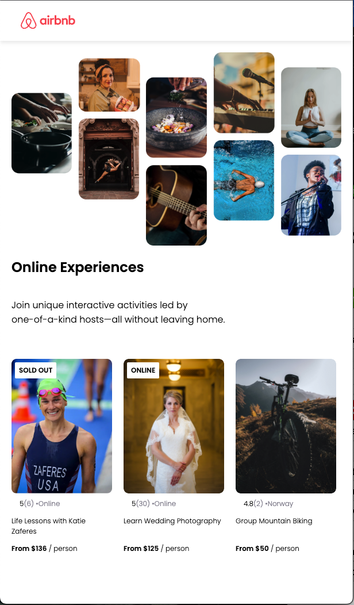

# reactPractice2

Built this project to build on top of the basics of React.

**Link to project:** https://react-practice2-nine.vercel.app/

**Tech used:** HTML, CSS, JavaScript, React

## What I Learned:

- How to use Props and how they work
- Create components from array of data
- Mapping components/ data to components

## Examples:

Take a look at these couple examples that I have in my own portfolio:

**Personal Website:** https://github.com/VENGEAANCE/portfolio2023

**OpenAi Image Generator:** https://github.com/VENGEAANCE/OpenAi-Image-Generator

**Meme Generator:** (building)
